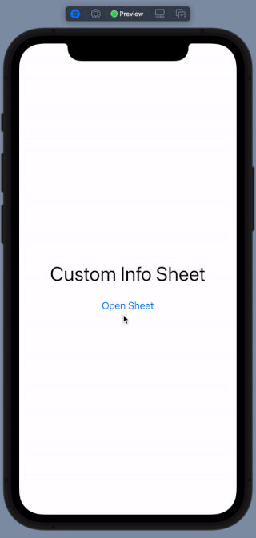
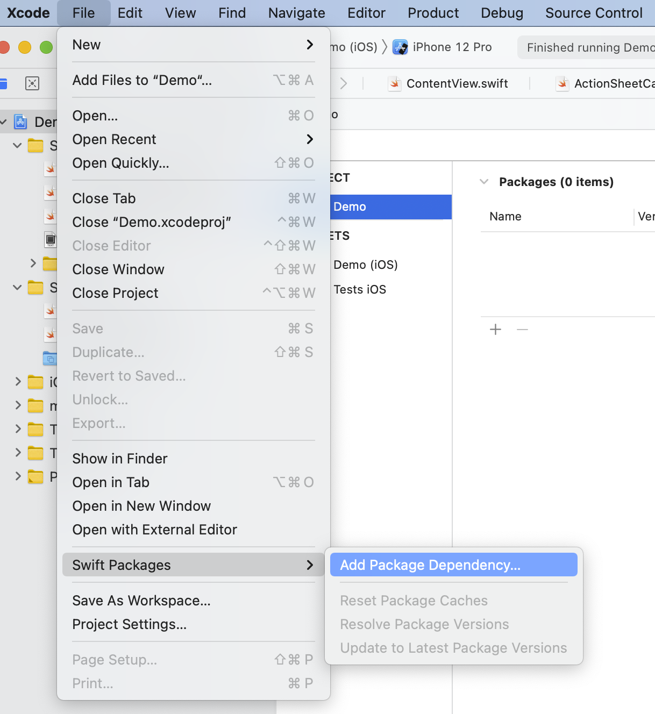

# ActionSheetCustomViewCard

<p align="center">
    <a href="https://github.com/mahmudahsan/SwiftUI-Action-Sheet-Custom-View-Card">
        
    </a>
    <a href="https://swift.org/package-manager">
        
    </a>
    <a href="https://twitter.com/mahmudahsan">
        
    </a>
</p>

A SwiftUI based custom sheet card to show any custom view inside the card in iOS application.

 <p align="center">
    
</p>

## Features
- Any custom view you can show inside the card

## How to use

Add this Swift package to your project
```
https://github.com/mahmudahsan/SwiftUI-Action-Sheet-Custom-View-Card
```

 <p align="center">
    
</p>

#### Import and use

```swift
import SwiftUI
import ActionSheetCustomViewCard

struct ContentView: View {
    @State var showingSheet = false
    
    var content: some View {
        VStack {
            Text("Custom Info Sheet")
                .font(.largeTitle)
                .padding()
            Button(action: {
                showingSheet = true
            }) {
                Text("Open Sheet")
            }
        }
        .edgesIgnoringSafeArea(.all)
    }
    
    func hideActionSheet() {
        showingSheet = false
    }
    
    var actionSheet: some View {
        ActionSheetCustomViewCard(content: {
            VStack {
                HStack {
                    Spacer()
                }
                HStack {
                    ZStack (alignment: .top){
                        HStack (alignment: .top){
                            Button(action: {
                                self.hideActionSheet()
                            }, label: {
                                Image(systemName: "xmark")
                                    .resizable()
                                    .aspectRatio(contentMode: .fit)
                                    .frame(width: 14, height: 14)
                                    .foregroundColor(.black)
                            })
                            .frame(width: 20)
                            .padding(.top, 2)
                            
                            Spacer()
                        }
                        
                        Spacer()
                        Text("Why do I need to connect to do the job?")
                            .multilineTextAlignment(.center)
                            .font(Font.system(size: 16.0, weight: .semibold, design: .rounded))
                            .padding(.horizontal, 72)
                            .fixedSize(horizontal: false, vertical: true)
                        
                        Spacer()
                    }
                }
                .padding(.bottom, 20)
                .padding(.horizontal, 18)
                
                Text("orem ipsum dolor sit amet, consectetur adipiscing elit. Aliquam a tempor nibh. Morbi porttitor leo nulla, vitae fringilla mauris molestie vel. Fusce lobortis, quam id luctus rutrum, urna sem tincidunt augue, sit amet varius diam odio quis massa.")
                    .multilineTextAlignment(.leading)
                    .fixedSize(horizontal: false, vertical: true)
                    .padding(.horizontal, 40)
                    .foregroundColor(.gray)
            }
            
        },
            isShowing: $showingSheet,
            outOfFocusOpacity: 0.2
        )
    }
    
    var sheetView: some View {
        VStack {
            Spacer()
            actionSheet
        }
    }
    
    var body: some View {
        ZStack {
            content
            sheetView
        }
    }
}
```
#### Steps
1. Add `import ActionSheetCustomViewCard` in your SwiftUI View
2. Define a `@State var showingSheet = false` state
3. Create the sheet view and pass any custom view
```Swift
ActionSheetCustomViewCard(content: {
                VStack {
                    HStack {
                        Spacer()
                    }
                    HStack {
                        ZStack (alignment: .top){
                            HStack (alignment: .top){
                                Button(action: {
                                    self.showingSheet = false
                                }, label: {
                                    Image(systemName: "xmark")
                                        .resizable()
                                        .aspectRatio(contentMode: .fit)
                                        .frame(width: 14, height: 14)
                                        .foregroundColor(.black)
                                })
                                .frame(width: 20)
                                .padding(.top, 2)
                                
                                Spacer()
                            }
                            
                            Spacer()
                            Text("Why do I need to connect to do the job?")
                                .multilineTextAlignment(.center)
                                .font(Font.system(size: 16.0, weight: .semibold, design: .rounded))
                                .padding(.horizontal, 72)
                                .fixedSize(horizontal: false, vertical: true)
                            
                            Spacer()
                        }
                    }
                    .padding(.bottom, 20)
                    .padding(.horizontal, 18)
                    
                    Text("orem ipsum dolor sit amet, consectetur adipiscing elit. Aliquam a tempor nibh. Morbi porttitor leo nulla, vitae fringilla mauris molestie vel. Fusce lobortis, quam id luctus rutrum, urna sem tincidunt augue, sit amet varius diam odio quis massa.")
                        .multilineTextAlignment(.leading)
                        .fixedSize(horizontal: false, vertical: true)
                        .padding(.horizontal, 40)
                        .foregroundColor(.gray)
                }
                
            },
                isShowing: $showingSheet,
                outOfFocusOpacity: 0.2
            )

```

4. Use the sheet in your main view within a `ZStack`, otherwise the black background view will not show correctly
```Swift
var body: some View {
        ZStack {
            content
            sheetView
        }
    }
```

**For more examples open `/Demo/Demo.xcodeproj`**


5. How to Change color of the sheet card background
```Swift
        ActionSheetCustomViewCard(content: {
            // Add any custom view 
            // Text("Hello")
        },
            isShowing: $showingSheet,
            outOfFocusOpacity: 0.2 // gray background opacity
        )
```

## Questions or feedback?

- Feel free to [open an issue](https://github.com/mahmudahsan/SwiftUI-Action-Sheet-Custom-View-Card/issues/new)
- Find me [@mahmudahsan on Twitter](https://twitter.com/mahmudahsan)
- Read programming articles on [Level Up Programming](https://thinkdiff.net)
